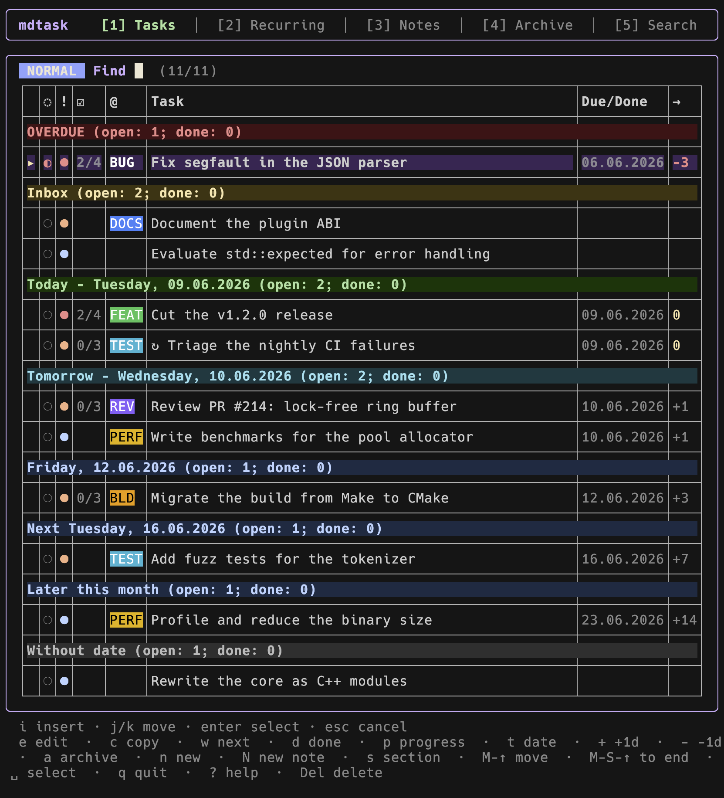
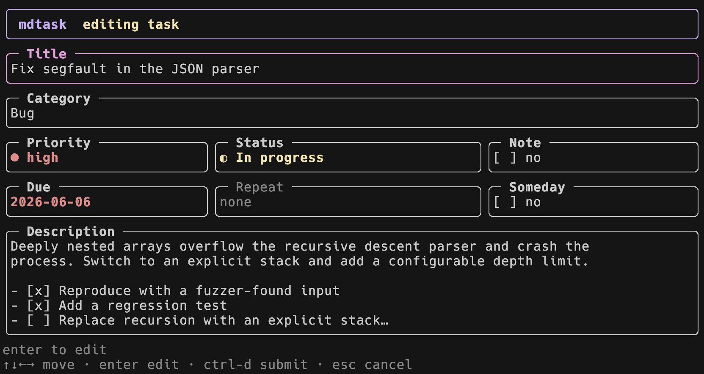

# mdtask – markdown-based task manager

A command-line task manager for modern C++ (C++26), built on a **layered architecture** and the [sparcli](https://github.com/cgroening/c-sparcli) library (fuzzy finder, forms, datepicker, markdown/YAML serde, layered config, XDG paths).

Every task is **one Markdown file**: the title is the H1, the description is the body, and the metadata lives in YAML front matter. There is no database and no lock-in – your data stays plain Markdown you can read, edit (e.g. in Obsidian) and back up however you like.

The main screen is a **fuzzy agenda**: tasks grouped into day sections, with priority colors and inline editing.



```
$ mdtask add "Fix segfault in the JSON parser" --due 2026-06-06 --priority high
Added [a01f2e3d4c5b] Fix segfault in the JSON parser

$ mdtask                       # opens the interactive fuzzy agenda
```

## The task file

`2026-06-06--fix-segfault-in-json-parser.md`:

```markdown
---
id: a01f2e3d4c5b
title: Fix segfault in the JSON parser
due: 2026-06-06
priority: high
someday: false
status: open
category: Bug
created: 2026-06-02
---

# Fix segfault in the JSON parser

Deeply nested arrays overflow the recursive descent parser. (free-form
Markdown body, e.g. subtasks as `- [ ]` / `- [x]` checkboxes)
```

- The file name is `<due>--<slug>.md` (or `nodate--<slug>.md`), always using ISO `YYYY-MM-DD` so files sort chronologically. The stable `id` in the front matter – not the file name – identifies the task.
- `status` is one of `open`, `in_progress`, `paused`, `done` or `cancelled`; `category`, `repeat`/`repeat_from` and `project` are optional and only written when set.
- `completed_at` is recorded when a task is marked done.
- Archiving moves the file to `archive/<year>/<month>/` instead of deleting it.

## Recurring tasks

Add a `repeat:` field to make a task recur. Marking it done does not finish it – it rolls the same file forward to its next due date and stays open, so the series always keeps a single active occurrence:

```yaml
repeat: weekly        # daily | weekly | monthly | yearly
                      # every 3 days | every 2 weeks | every 6 months
                      # mon,wed,fri   (a set of weekdays)
repeat_from: due      # due (default) or completion
```

- `repeat_from: due` keeps a fixed cadence (a weekly meeting stays on its weekday even if you check it off early or late); a long-overdue series jumps straight to its next future date.
- `repeat_from: completion` measures the next date from the day you complete it (e.g. `every 3 days` restarts the clock when you do it).

A recurring task is marked with a leading `↻` in the agenda. The **Recurring** view (`2`) lists each series' upcoming occurrences for the current and next week (at least the next one). In the task form, the **Repeat** field shows the current rule; press **r** to open a small wizard that asks only what applies (a count for days/weeks/months/years, *or* a set of weekdays, then the basis). Choose `none` to end the series. Editing the task's `.md` file (`e`) works too.

## Agenda sections

Sections are computed from the front matter and only shown when non-empty:

- **OVERDUE** – due before today.
- **Inbox** – no due date and not someday.
- **Today / Tomorrow / <date>** – one section per dated day for the rest of this week.
- **Later this month / Next month / Later** – dated tasks beyond this week, rolled up into month buckets instead of one section per day.
- **Without date** – no due date, marked `someday`.

## The task form

Pressing `Enter` on a task opens a form with all of its fields:



- **Title**, **Category** (a dropdown), **Priority** (none/low/medium/high) and **Status** (open/in progress/paused/done/cancelled).
- **Note** – a checkbox that turns the item into a note instead of a task.
- **Due** – a date picker; **Someday** – defer a dateless task.
- **Repeat** – a read-only summary of the recurrence rule (see below).
- **Description** – the Markdown body.

Keys: `Enter` edits the focused field, `Ctrl-G` opens the description in `$EDITOR`, `r` opens the recurrence wizard, `s` or `Ctrl-D` saves, and `Esc` cancels (offering to save if there are unsaved changes).

## Notes view

Besides tasks, mdtask keeps **notes** – the same one-Markdown-file-per-item model without a due date or status. The **Notes** view (`3`) is a flat list ordered by a manual sort order then title. `n` adds a note, `N` adds a task instead, `e` opens the file in `$EDITOR`, `c` duplicates it and `a` archives it.

## Fuzzy agenda keys

Modal (vim-style): the finder starts in normal mode.

- `1` / `2` / `3` / `4` / `5` – switch view: Tasks / Recurring / Notes / Archive / Search (Search is a placeholder for now).
- `Enter` – edit the task in a form (Ctrl-G opens the description in `$EDITOR`).
- `e` – open the whole `.md` file in `$EDITOR` (or the configured `editor`); the file is reloaded and renamed afterwards if its due date or title changed.
- `d` – cycle the terminal status: done → cancelled → open (greyed in place, kept until archived).
- `p` – toggle in progress ↔ paused.
- `w` – toggle a "Next: …" banner recommending the most urgent task (by due date, then priority); `W` jumps the cursor to it.
- `t` – pick a due date from a calendar.
- `+` / `-` – shift the due date by one day (`=` also shifts forward; the cursor stays on the task).
- `a` – archive the task (in the Archive view, `r` restores it instead).
- `c` – duplicate the task/note (title gets a numbered `(copy)` suffix; the cursor lands on the new copy).
- `n` – add a new task (`N` adds the opposite item type).
- `s` – jump to a section (a picker over the section headers).
- `Alt+↑` / `Alt+↓` – reorder the task; `Alt+Shift+↑` / `Alt+Shift+↓` move it to the top / bottom.
- `Delete` / `Backspace` – delete the file permanently (asks to confirm).
- `Space` – mark/unmark the task; `d`, `p`, `a`, `t`, `+`/`-` and `Delete` then apply to every marked task at once.
- `i` – filter (type to search titles); `Esc` returns to normal mode.
- `?` – show all keyboard shortcuts.
- `q` – quit (`Esc` also quits from normal mode).

The first column shows a status glyph; the row also carries a subtask progress count (`2/5`, from `- [ ]`/`- [x]` checkboxes in the body) and a signed relative-due offset (`0` today in yellow, `+3` future in gray, `-2` overdue in red). Section headers show `(open: x; done: y)`.

## CLI commands

```
mdtask                      open the interactive fuzzy agenda (main screen)
mdtask add [TITLE]          add a task (prompts for the title if omitted)
mdtask list [-f plain]      list tasks (table by default; plain for scripts)
mdtask done [<id>]          toggle a task's done state (picks one if no id)
mdtask edit <id>            edit a task in the form
mdtask archive <id>         archive a task
mdtask config               show the resolved configuration and file locations
mdtask completion           print the zsh completion script
```

`add` takes `-d/--due <YYYY-MM-DD>`, `-p/--priority <none|low|medium|high>`, `-m/--description <text>` and `-s/--someday`. Global flags: `-v/--verbose` (debug logging on stderr), `--version` and `--help`.

## Build

mdtask targets **POSIX systems only** (macOS and Linux); it relies on XDG paths and a real terminal, and is not supported on Windows.

mdtask links against [sparcli](https://github.com/cgroening/c-sparcli) (resolved via `pkg-config`):

```
make            # build bin/mdtask
make test       # build and run the test suite
make sanitize   # run the tests under AddressSanitizer/UBSan
```

To build against a local sparcli checkout without installing it:

```
make SPARCLI_CFLAGS=-I/path/to/sparcli/include \
     SPARCLI_LIBS=/path/to/sparcli/libsparcli.a
```

## Configuration

Optional TOML at `$XDG_CONFIG_HOME/mdtask/config.toml`; see [`examples/config.toml`](examples/config.toml). Keys: `tasks_dir`, `archive_dir`, `notes_dir`, `notes_archive_dir` (the notes and archive locations default to siblings of `tasks_dir`), `date_format` (`dmy`/`iso`), `language` (`english`/`german`, for the weekday names in section headers), `editor`, `log_file` and `log_level`. Any key can be overridden by an `MDTASK_`-prefixed environment variable, e.g. `MDTASK_TASKS_DIR`. Run `mdtask config` to print the resolved values.

Categories are a configured dropdown. Define them as `[[categories]]` array-of-tables, each with a long-form `name` (shown in the task form), a `short` badge text (shown in the agenda), and `fg`/`bg` colors (a color name or `#RRGGBB`). "-" (no category) and "Project" are always available; the latter is reserved for assigning a project once project management lands. The chosen category is stored as `category:` in the task's front matter.

Try it with the bundled sample tasks:

```
MDTASK_TASKS_DIR=$(pwd)/examples/tasks ./bin/mdtask
```

## Architecture

Layered, with dependencies pointing inward:

- `domain/` – `Task`, `Priority`, and the pure `agenda` grouping.
- `storage/` – the `TaskRepository` port, the Markdown-backed implementation, an in-memory fake, and the task-agnostic `markdown_document` helper (the seed for a future reusable markdown-database library).
- `service/` – `TaskService`: validation, id/timestamp generation, state transitions.
- `config/` – layered configuration (defaults < file < env).
- `cli/` – one Command per subcommand.
- `tui/` – the fuzzy finder, the form, and presentation helpers.
- `main.cpp` – the composition root.

See [TODO.md](TODO.md) for the planned v0.2 work (project management / DoneZilla rewrite, configurable field schema, `mddb` extraction, recurring tasks, Qt GUI).
